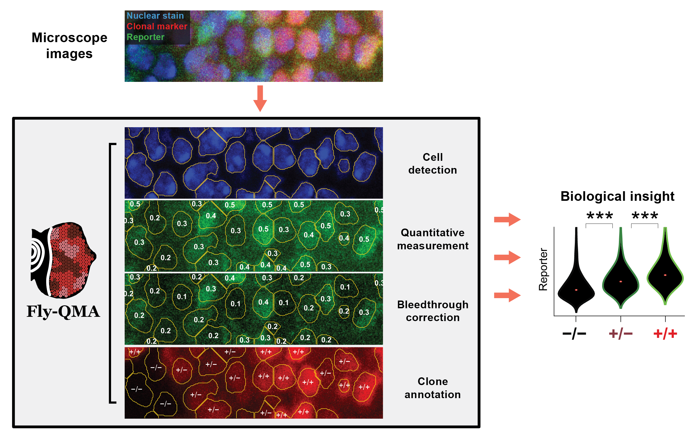

Fly-QMA
=======

**Fly-QMA** is part of the **NU FlyEye** platform for quantitative analysis of *Drosophila* imaginal discs. The package enables Quantitative Mosaic Analysis (QMA) - that is, it helps users quantify and analyze expression patterns in mosaic tissues.

Expression patterns are typically identified by comparing the intensities of fluorescent reporters between groups of cells. Fly-QMA uses computer vision to quantify these differences in reporter expression by inferring them from microscope images. The measurements may then used to detect and analyze spatial patterns that might otherwise go unnoticed.

Given microscopy data, Fly-QMA facilitates:
  - Automated **detection** of cell nuclei
  - Automated **measurement** of reporter expression levels
  - Automated **bleedthrough control** for enhanced measurement accuracy
  - Automated **annotation** of clonal patch patterns
  - **Statistical analysis** of expression levels and tissue morphology

Please visit the [Fly-QMA homepage](https://sbernasek.github.io/flyqma/start.html) for tips on getting started with your own data.

Installation
============

Installing Fly-QMA is easy. Set up a working environment running Python 3.6+, then install via  ``pip``:

    pip install flyqma

Getting Started
===============

See the [Fly-QMA tutorial](https://github.com/sbernasek/flyqma/blob/master/tutorial.ipynb).

Additioanl Examples
===================

For examples of complete projects utilizing Fly-QMA and the entire **NU FlyEye** platform, check out:

 - [Our Fly-QMA manuscript](https://doi.org/10.1101/775783)
 - [Our study](https://doi.org/10.1101/430744) of Pnt and Yan expression during retinal patterning in *Drosophila*.

Authors
=======

[Amaral Lab](https://amaral.northwestern.edu/)
