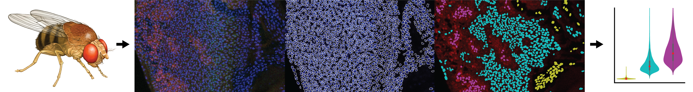

================
NU FlyEye Clones
================

.. image:: graphics/Northwestern_purple_RGB.png
   :width: 30%
   :align: right
   :alt: nulogo

*FlyEye Clones* is a python-based platform for analyzing protein expression patterns in the developing *Drosophila* eye. The package enables quantitative comparisons of expression between distinct clonal subpopulations within the eye epithelium.

Expression patterns are typically identified by comparing the fluorescence of target gene reporters between groups of cells. *FlyEye Clones* helps quantify these differences in reporter expression. Quantification entails measuring fluorescence intensities by analyzing experimentally collected images of fixed eye discs. Such measurements may then used to identify and compare distinct subpopulations within the eye field.

Given confocal microscopy data, *FlyEye Clones* facilitates:

  - **Segmentation:** automated detection of cell nuclei

  - **Measurement:**  quantification of reporter expression levels

  - **Bleedthrough Control:** correction of fluorescence bleedthrough

  - **Annotation:** automated labeling of clonal subpopulations

  - **Cell Selection:** manual selection of cells for comparison

  - **Comparison:** statistical comparison of subpopulations

The initial release is primarily limited to basic tools required to replicate `our study <https://github.com/sebastianbernasek/pnt_yan_ratio>`_ of Pnt and Yan expression during retinal patterning in *Drosophila*. We intend to expand this functionality in later releases.

.. toctree::
   :hidden:
   :maxdepth: 2

   INSTALLATION <installation>
   API DOCUMENTATION <modules>
   GETTING STARTED <gettingstarted>
   EXAMPLE USAGE <usage>
   CONTACT US <contactus>
