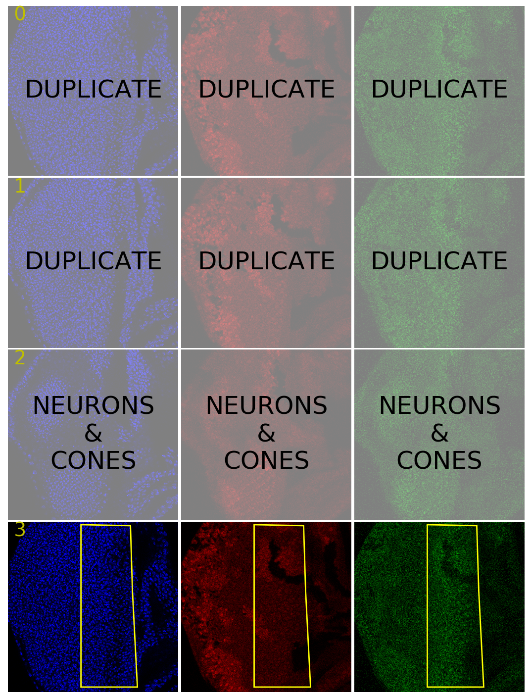

.. image:: graphics/Northwestern_purple_RGB.png
   :width: 30%
   :align: right
   :alt: nulogo
   :target: https://amaral.northwestern.edu/

Basic Usage
===========

**Fly-QMA** provides a wide range of functionality for measuring and analyzing mosaic imaginal discs. A brief introduction to some basic operations is provided below. For explicit API details please see the :ref:`code documentation <documentation>`.

Querying Data
-------------

We recommend first organizing your images in accordance with our recommended hierarchical :ref:`file structure <filestructure>`. In the examples below, ``./data`` would contain several subdirectories, each of which contains a single ``.tif`` file. Once everything is in place, get started by creating an ``Experiment`` instance. This will serve as the entry-point for managing your data in Fly-QMA.

.. code-block:: python

   >>> from flyqma.data import experiments
   >>> path = './data'
   >>> experiment = experiments.Experiment(path)

Lower levels of the data hierarchy may then be accessed in a top-down manner. Methods acting upon lower level instances are executed in place, meaning you won't lose progress by iterating across instances or by coming back to a given instance at a different time.

Select a specific image stack:

.. code-block:: python

   >>> stack_id = 0
   >>> stack = experiment[stack_id]

Select a specific layer:

.. code-block:: python

   >>> layer_id = 0
   >>> layer = stack[layer_id]

Select a specific fluorescence channel:

.. code-block:: python

   >>> channel_id = 0
   >>> channel = layer.get_channel(channel_id)

Segmenting Images
-----------------

Segment an image layer, measure the segment properties, and save the results:

.. code-block:: python

   >>> background_channel = 2
   >>> layer.segment(background_channel)
   >>> layer.save()

See the measurement :ref:`documentation <measurement_docs>` for additional details and parameters needed to customize the segmentation routine to suit your data.

.. _gui:

Defining a ROI
--------------

To import an externally generated ROI mask please refer to the :ref:`integration <roi_integration>` section.

Fly-QMA includes a matplot-lib based GUI for selecting a particular region of interest within an image layer. The interface consists of a grid of images in which rows correspond to layers and columns correspond to each of the available fluorescence channels. To launch the GUI for an individual image stack:

.. code-block:: python

   >>> from flyqma.selection.gui import GUI

   >>> # load a stack, including its image
   >>> stack = experiment.load_stack(stack_ind, full=True)

   >>> # create the GUI interface (a still image)
   >>> gui = GUI(stack)

   >>> # connect interface to user input
   >>> gui.connect()

Regions of interest are selected by drawing a selection boundary that encloses them. A selection boundary is defined by a series of sequentially-added points. Click on a layer image to add a point to that layer's selection boundary. Points may be added to any of a layer's fluorescence channels, and will automatically appear withing all other fluorescence channels for that layer. The most recently added point appears as a large red dot, while all other points appear as small yellow dots. Once three or more dots are present in an image layer, the current selection boundary is displayed with a yellow line. Once completed, a given layer might look like:

   **Example:** ROI boundaries for two layers, one of which is excluded.

The GUI offers some basic key commands:

.. code-block:: bash

   T: remove last added point
   Y: remove all points in layer
   W: save ROI selection
   Q: exit GUI

When a selection is saved, a boolean *selected* attribute is added to the layer's cell measurement data indicating whether or not a given cell lies within the layer's selection path. The *selected* attribute may then be used to filter the measurement data during subsequent analysis. The GUI also allows the user to mark entire layers for exclusion using an additional key commands:

.. code-block:: bash

   E: exclude entire layer

Layers marked *excluded* will be masked by a transparent overlay. When these layers are saved, the *selected* attribute is set to False for all of their constituent cell measurements.

A saved GUI may be reopened via the ``GUI.load`` method, at which point further adjustments may be made to each layer.

See the ROI selection :ref:`documentation <selection_docs>` for additional details.

Correcting Bleedthrough
-----------------------

Perform bleedthrough correction:

.. code-block:: python

   >>> from flyqma.bleedthrough.correction import LayerCorrection
   >>> correction = LayerCorrection(layer)
   >>> correction.save()

See the bleedthrough correction :ref:`documentation <bleedthrough_docs>` for additional details and a complete list of available parameters.

Aggregating Data
----------------

Aggregate all measurement data from an experiment:

.. code-block:: python

   >>> data = experiment.aggregate_measurements()

**The processed cell measurement data are now ready for analysis!**

Additional Examples
-------------------

For real usage examples, please refer to the `FlyQMA manuscript <https://github.com/sebastianbernasek/flyqma_ms>`_ and the `our study <https://github.com/sebastianbernasek/pnt_yan_ratio>`_ of Pnt and Yan expression in the developing eye.
