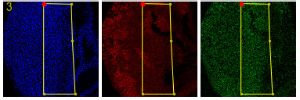
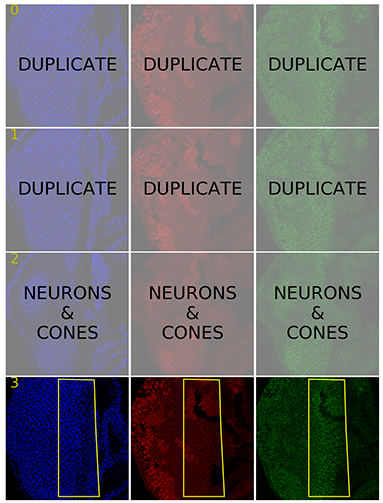

.. image:: graphics/Northwestern_purple_RGB.png
   :width: 30%
   :align: right
   :alt: nulogo
   :target: https://amaral.northwestern.edu/

Example Usage
=============

**FlyEye Clones** provides a wide range of functionality for measuring and analyzing gene expression in eye clones. A brief introduction to some basic operations is provided below. For detailed usage instructions please see the :ref:`documentation <documentation>`.

Loading image data
------------------

Load an experiment from a directory containing subdirectories of ``.tif`` files:

.. code-block:: python

    from clones.data import experiments

    path = './data'
    experiment = experiments.Experiment(path)

Select an individual image stack:

.. code-block:: python

    stack_id = 0
    stack = experiment[stack_id]

Select an individual layer:

.. code-block:: python

    layer_id = 0
    layer = stack[layer_id]

Measuring expression
--------------------

Segment an image layer, measure the segment properties, and save the results:

.. code-block:: python

    layer.segment()
    layer.save()

Bleedthrough Correction
-----------------------

Perform bleedthrough correction:

.. code-block:: python

    from clones.bleedthrough.correction import LayerCorrection

    correction = LayerCorrection(layer, niters=50)
    correction.show_correction()
    correction.save()

Cell Selection GUI
------------------

The clones package includes a matplot-lib based GUI for selecting a particular region of interest within an image layer. The interface consists of a grid of images in which rows correspond to layers and columns correspond to each of the available fluorescence channels. To launch the GUI for an individual image stack:

.. code-block:: python

    from clones.selection.gui import GUI

    # load a stack, including its image
    stack = experiment.load_stack(stack_ind, full=True)

    # this creates the GUI interface (just a still image)
    gui = GUI.load(stack)

    # connect interface to user input
    gui.connect()

Regions of a layer are selected by drawing a selection boundary that encloses them. A selection boundary is defined by a series of sequentially-added points. Click on a layer image to add a point to that layer's selection boundary. Points may be added to any of a layer's fluorescence channels, and will automatically appear withing all other fluorescence channels for that layer. The most recently added point appears as a large red dot, while all other points appear as small yellow dots. Once three or more dots are present in an image layer, the current selection boundary is displayed with a yellow line. Once completed, a given layer might look like:

   **Example:** Selection boundary for a layer

The GUI offers some basic key commands:

.. code-block:: bash

   Z: remove last added point
   M: remove all points in layer
   S: save selection (for all layers in stack)
   X: exit GUI

When a selection is saved, a boolean *selected* attribute is added to the layer's cell measurement data indicating whether or not a given cell lies within the layer's selection path. The *selected* attribute may then be used to filter the measurement data during subsequent analysis. The GUI also allows the user to mark entire layers for exclusion using two additional key commands:

.. code-block:: bash

   N: mark layer as neurons & cones
   D: mark layer as duplicate

Layers marked *neurons & cones* or *duplicate* will be masked by a transparent overlay. When these layers are saved, the *selected* attribute is set to False for all of their constituent cell measurements.

A saved GUI may be reopened via the ``GUI.load`` method, at which point further adjustments may be made to each layer.

   **Example:** A completed selection

Data Aggregation
----------------

Aggregate all measurement data for an experiment:

.. code-block:: python

    data = experiment.aggregate_measurements()

Additional Examples
-------------------

For detailed usage examples, please refer to the `code <https://github.com/sebastianbernasek/pnt_yan_ratio>`_ used to generate the figures in our manuscript.
